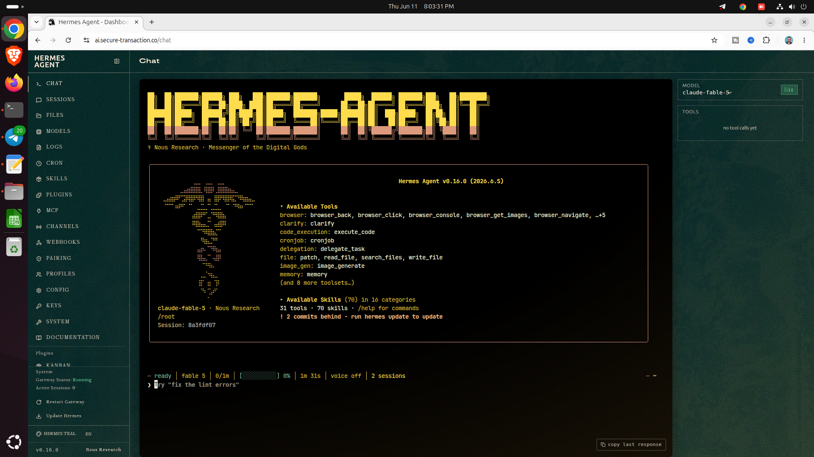

<p align="center">
  
</p>

# Hermes Agent ☤
<p align="center">
  <a href="https://github.com/SchoolOfFreelancing/Hermes-Agent-Training.git/">Hermes Agent Training</a> | <a href="https://github.com/SchoolOfFreelancing/Hermes-Agent-Support.git/">Hermes Agent Support</a>
</p>

 <p align="center">
  <a href="https://hermes-agent.nousresearch.com/docs/" target="_blank">
    
  </a>
  <a href="https://t.me/AnythingLinux" target="_blank">
    
  </a>
  <a href="https://github.com/NousResearch/hermes-agent/blob/main/LICENSE" target="_blank">
    
  </a>
  <a href="https://nousresearch.com" target="_blank">
    
  </a>
</p>

# Hermes Agent Installation Support

Professional Hermes Agent Installation Support including production-grade setup, AI API integration, troubleshooting, optimization, and ongoing maintenance.

## What You'll Get Support?
- 🧠 Hermes Agent Installation Full Support
- 🌐 Cloud & VPS server setup (DigitalOcean, AWS, etc.)
- 🔌 Cloud AI API & local LLM integration
- 🔐 NGINX reverse proxy configuration
- 🔒 SSL certificate setup (HTTPS secure deployment)
- ⚡ Performance optimization & scaling
- 🛠️ Troubleshooting & bug fixing
- 🔄 Maintenance & on-demand support

## Reach out if you need professional support
💬 Telegram: https://t.me/AnythingLinux

📩 WhatsApp: https://wa.me/8801890757616

## Who Can Benefit?
- AI Startups
- SaaS Founders
- Startup Developers
- AI Engineers
- Agencies
- Self-hosting enthusiasts
- Enterprise teams
- Businesses deploying AI assistants

# Hermes Agent

```
───────────────────────────────────────────────
✧(｡•̀ᴗ-)✧ Hermes Agent: Stable Release
───────────────────────────────────────────────
```



## Disclaimer
This repository is intended to provide guidance, documentation, and support resources related to Hermes Agent installation. Product names, trademarks, and service names belong to their respective owners.

⭐ If this repository helps you, please consider starring it and sharing it with others.
